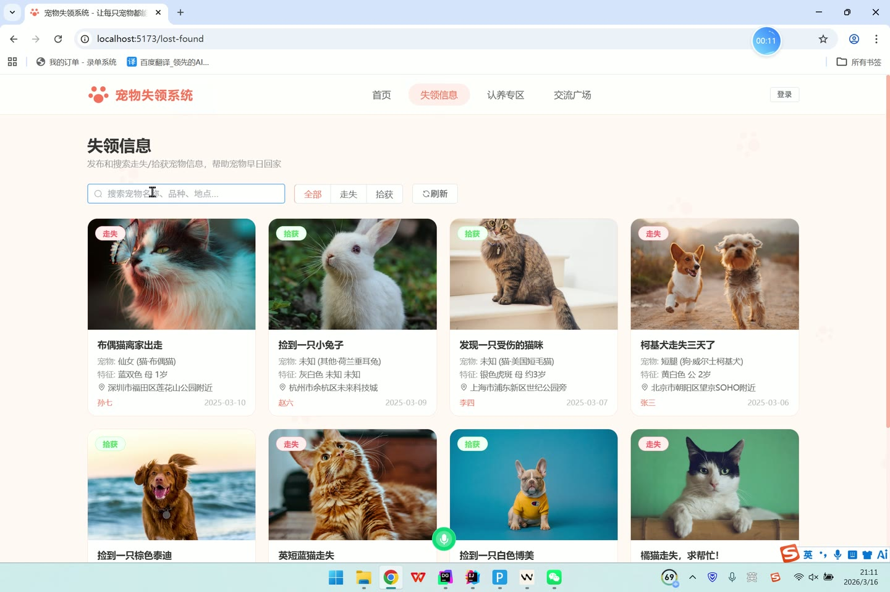
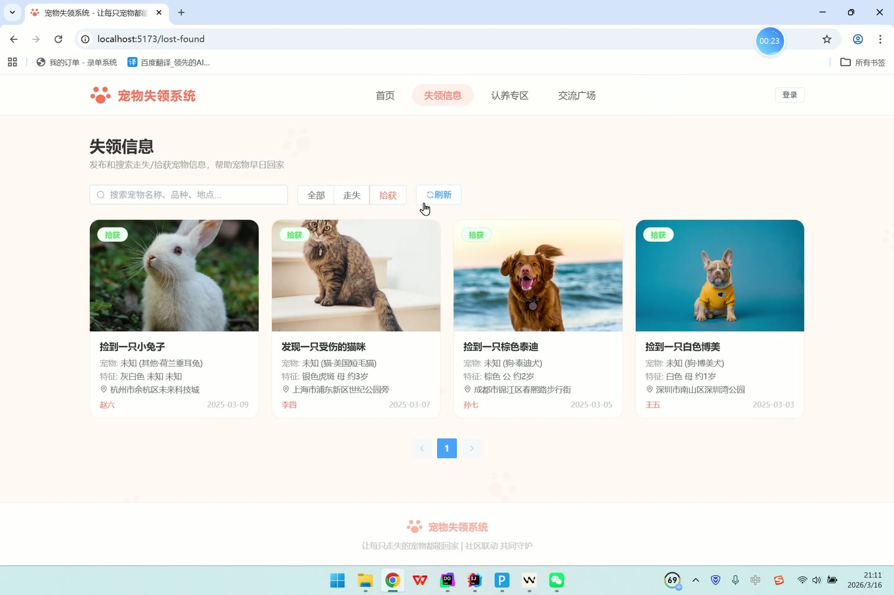
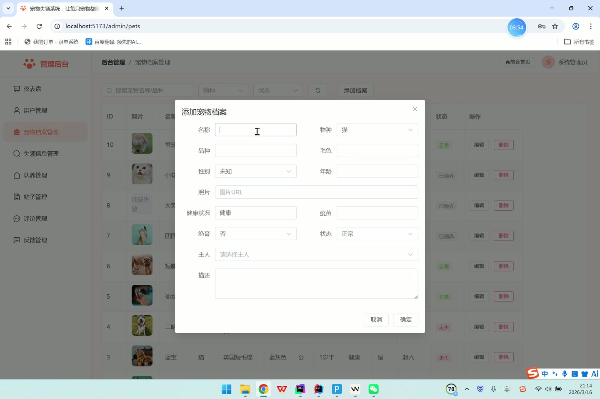
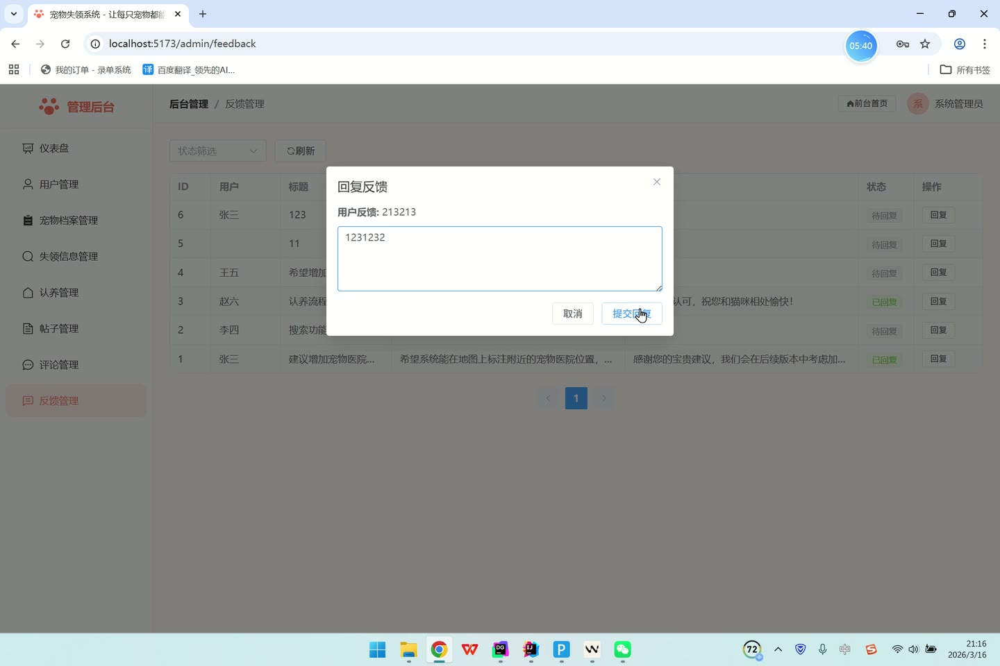
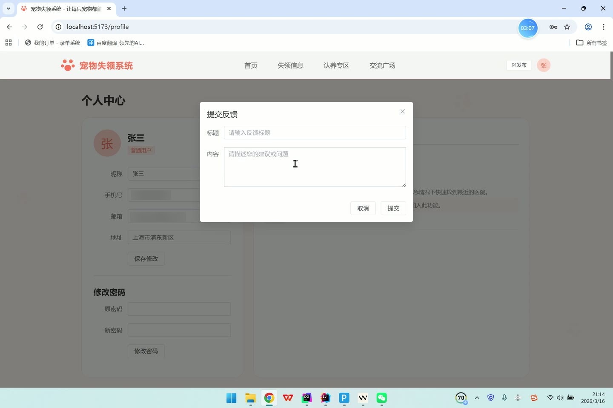

# (附文档)Springboot3+Vue3+MySQL 宠物失领系统

**技术栈**：Springboot3、Vue3、MySQL

### 系统简介

本系统是一个基于 Spring Boot 3 + Vue 3 + MySQL 的宠物失领与认养管理平台，采用前后端分离架构。系统支持普通用户端和管理员端两个角色，提供宠物走失/捡拾信息发布、宠物认养申请、社区交流论坛、宠物档案管理、用户反馈等核心业务功能，实现从宠物丢失到认领/认养的全流程管理。
 
### 核心功能
 
### 普通用户端

 
- 用户注册与登录：通过用户名和密码注册账号，登录后获取 Token 进行身份认证，支持快捷登录（管理员/普通用户）。 
- 个人信息管理：修改个人资料（昵称、头像、手机号、邮箱、地址），修改登录密码（需验证原密码）。 
- 发布走失信息：填写宠物名称、物种、品种、颜色、性别、年龄、照片、描述、丢失地点、联系电话等信息，发布后状态为“待审核”。 
- 发布捡拾信息：填写捡拾到的宠物信息（字段同走失），发布后状态为“待审核”。 
- 查看我的失领记录：分页查看自己发布的所有走失/捡拾信息列表，支持编辑和删除操作。 
- 发布认养信息：填写宠物名称、物种、品种、颜色、性别、年龄、健康状况、描述、位置、联系电话等，发布后状态为“待审核”。 
- 提交认养申请：对某个认养信息提交认养理由，申请状态初始为“待审核”。 
- 查看我的认养申请：分页查看自己提交的所有认养申请记录及其审核状态。 
- 社区论坛发帖：发布帖子（标题、内容、图片、分类），发布后自动为“已审核”状态，支持浏览量统计和点赞。 
- 帖子评论：对帖子发表评论，支持嵌套回复（通过 parentId 实现），用户可删除自己的评论。 
- 提交反馈：填写反馈标题和内容，提交后状态为“未回复”，可查看自己的反馈列表及管理员回复。 
- 文件上传：上传宠物照片等图片文件，返回文件 URL 用于其他功能。 
- 浏览公开信息：查看已审核通过的走失/捡拾信息列表（支持按关键词搜索、按类型筛选）、认养信息列表（仅显示“可领养”状态）、社区帖子列表（支持按分类筛选）。 
- 查看详情：查看走失/捡拾信息详情、认养信息详情、帖子详情（帖子详情自动增加浏览量）。 
- 查看认养申请列表：查看某个认养信息下的所有申请列表。 
- 查看公共统计数据：查看平台用户数、走失数、捡拾数、可领养数、已解决数、帖子数等统计。
 
### 管理员端

 
- 仪表盘统计：查看平台总用户数、走失信息数、捡拾信息数、认养信息数、帖子数、宠物档案数、反馈数、待审核失领数、待审核认养数。 
- 用户管理：分页查看用户列表（支持按用户名/昵称/手机号搜索），编辑用户信息（昵称、手机号、邮箱、地址等），启用/禁用用户账号，删除用户。 
- 失领信息审核：分页查看所有走失/捡拾信息（支持按关键词搜索、按状态筛选），审核通过或拒绝信息，删除信息。 
- 认养信息审核：分页查看所有认养信息（支持按关键词搜索、按状态筛选），审核通过（设为可领养）或拒绝（关闭），删除信息。 
- 认养申请审核：分页查看所有认养申请（支持按状态筛选），审核通过或拒绝申请。 
- 帖子管理：分页查看所有帖子（支持按关键词搜索、按状态筛选），审核通过或拒绝帖子，删除帖子。 
- 评论管理：分页查看所有评论，删除违规评论。 
- 反馈管理：分页查看所有用户反馈（支持按状态筛选），回复反馈内容，标记为已回复。 
- 宠物档案管理：分页查看所有宠物档案（支持按关键词/物种/状态搜索），新增宠物档案，编辑宠物信息，删除宠物档案。
 
### 技术栈

 后端框架Spring Boot 3 ORMMyBatis-Plus（自动分页、逻辑删除、自动填充） 权限认证自定义 Token 拦截器（LoginInterceptor） 前端框架Vue 3（Composition API） 状态管理Pinia（useUserStore） 构建工具Vite 前端路由Vue Router（createWebHistory） UI 组件库Element Plus 数据库MySQL（MyBatis-Plus 自动映射） 文件上传MultipartFile 本地存储 密码加密MD5（DigestUtils）
 
### 交付内容

 
- 后端完整源码 
- 前端完整源码 
- 数据库初始化脚本 
- 万字文档

## 界面展示

---

## 获取完整源码 + 万字文档

本仓库为项目介绍页。**完整前后端源码、数据库初始化脚本、万字项目文档**，请加微信 `kangkangcode`，或访问 [codekk.top](http://codekk.top) 获取。

可作课程设计 / 毕业设计参考，支持远程部署调试。